# Piedra Papel Tijeras

Este repositorio está hecho para poder aprender Unity3D y C# básico

Este proyecto está hecho en unity 2018.4.10(LTS) y se exportará para sistemas Windows Mac Linux y Webgl

## Cómo usarlo

### Para aprender

Sigue paso a paso las instrucciones en este README en caso de tener problemas puedes comparar tu proceso con el mío, en cada commit

### Para enseñar

Si deseas usar este material como recurso didáctico te recomiendo que leas este readme veas el proceso y si deseas hacer modificaciones haz fork a este repositorio, si por el contrario te parece bien y quieres usar la estructura que aquí propongo puedes clonar el repositorio con el siguiente comando:

``` bash
git clone https://github.com/dragaus/Piedra_Papel_Tijeras.git
```

No olvides reconocer la autoría

## Contenido en este repo

- [Crear el proyecto](#-Crear-el-proyecto)
- [Conociendo el editor](#-Conociendo-el-editor)
- Autor

## Crear el proyecto

Para crear el proyecto necesitaremos tener instalado Unity Hub y Unity 2018.4.10(LTS).

Abriremos Unity Hub y en la pestaña de projects seleccionamos NEW en caso de tener múltiples versiones de Unity instaladas seleccionaremos la flecha y después escogeremos 2018.4.10

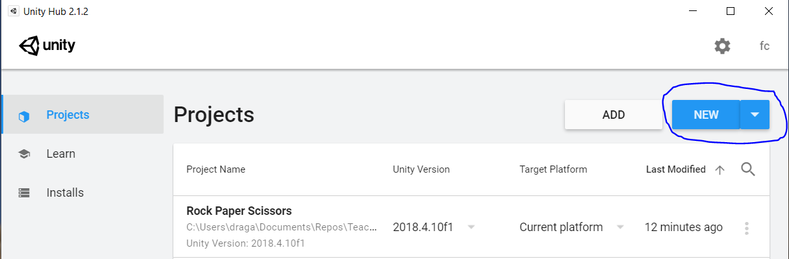

Nos abrirá una nueva ventana en esta seleccionaremos el template 2D (<span style="color:blue">en un círculo azul en la imagen</span>), pondremos un nombre al repositorio en la parte de project name (<span style="color:red">en círculo rojo</span>) en este caso Piedra_Papel_Tijeras, y después seleccionaremos la ruta donde deseamos que se genere el proyecto (<span style="color:green">en círculo verde</span>) y después seleccionaremos el botón CREATE.

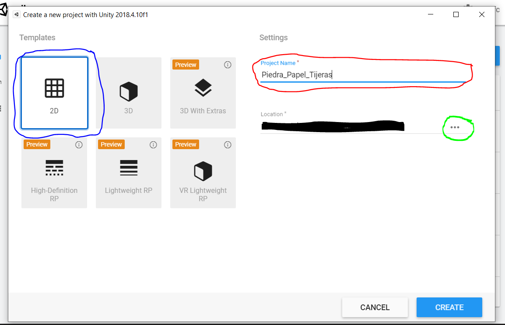

Esto generará un nuevo proyecto y nos abrira el editor.

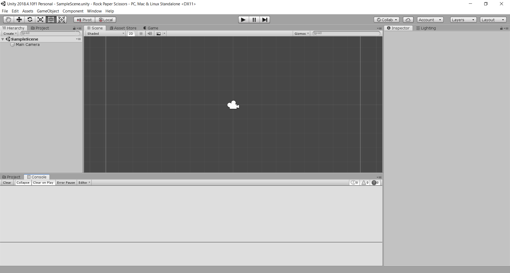

## Conociendo el editor

Vamos a hablar un poco del editor y de sus partes:

### Hierarchy

Aquí se irán organizando los GameObjects que vayamos agregando a nuestra escena, y en él podremos organizarlos.

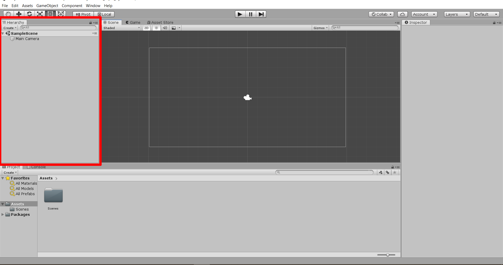

### Scene

Aquí podremos modificar los elementos de nuestra escena para acomodarlos en la forma que deseemos dentro de la escena

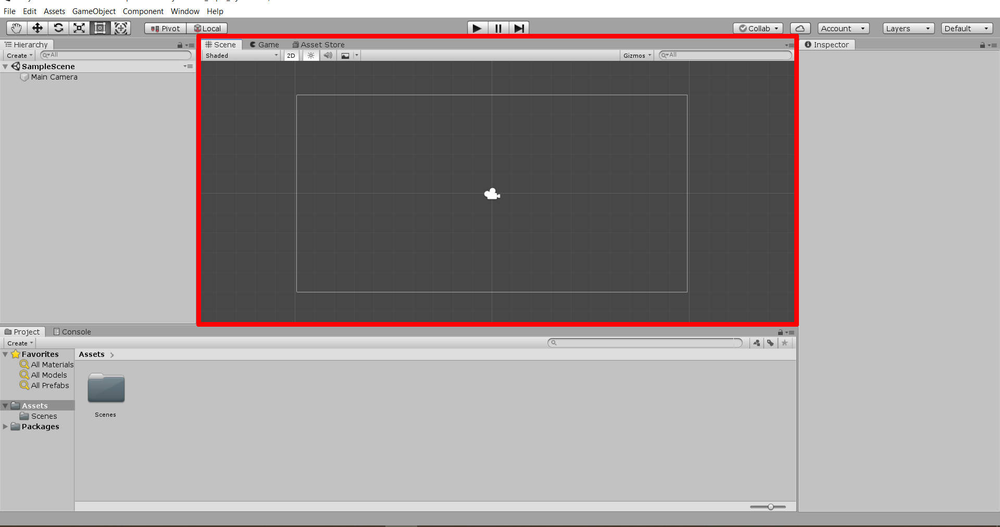

### Game

Esta ventana se utilizará cuando corramos nuestro juego para mostrar un preview de como correria el juego ya en la plataforma exportada. Cabe recalcar que aunque el modo "Play" es una buena representación de como funcionara el juego, siempre se debe exportar el juego y probar en la plataforma deseada para corregir cualquier error que se muestre.

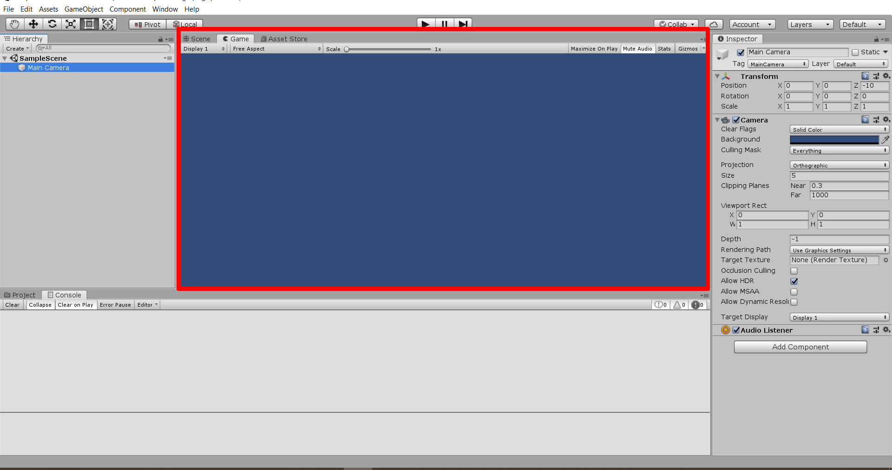

### Asset Store

Esta pestaña es una ventana web para abrir el asset store de unity aquí podremos comprar algunos plugins, No usaremos esta ventana en este Tutorial

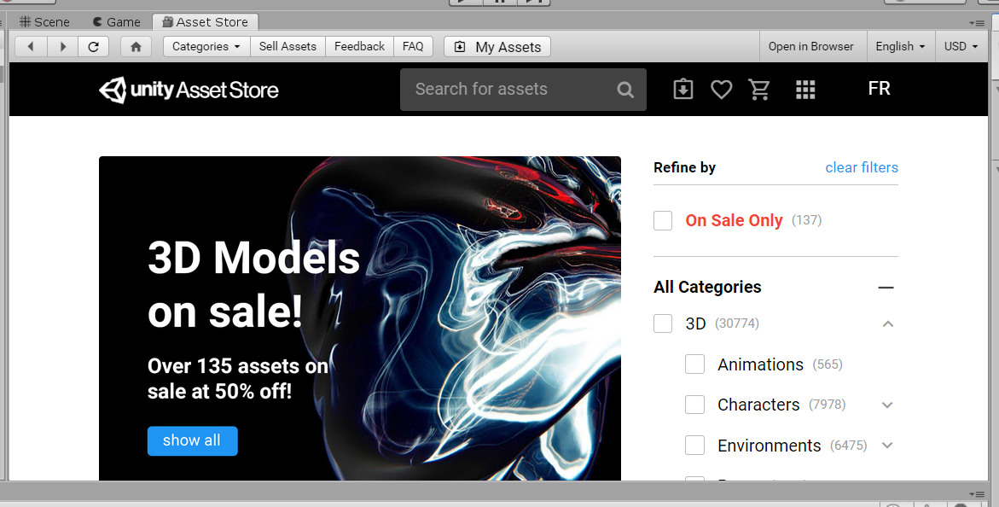

### Inspector

Este apartado nos mostrará los detalles de los objetos que seleccionemos, más adelante conoceremos más de su uso.


### Project

Este es un explorador de archivos que tenemos dentro de nuestro editor para poder trabajar con ellos dentro de nuestro proyecto

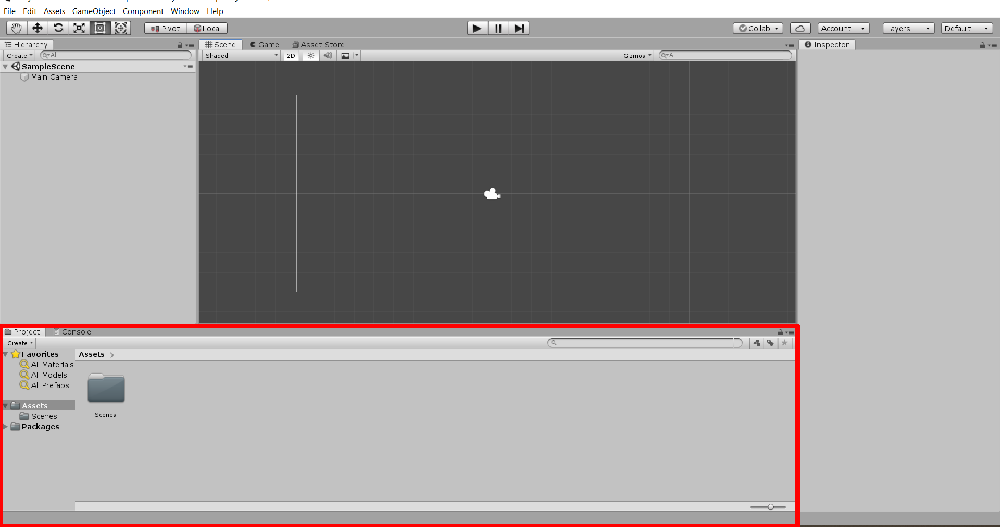

### Console

Esta será nuestra consola, aquí se imprimirán mensajes relacionados al funcionamiento de nuestro proyecto, entre ellos advertencias, errores y más.

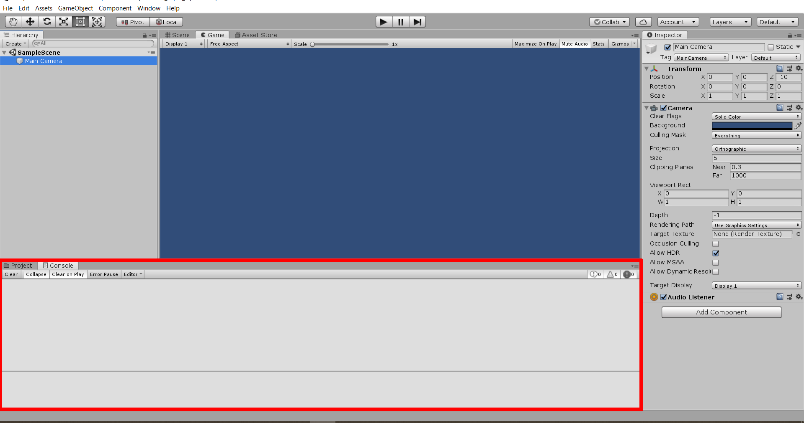

### Botones Editor

Estos botones se usan para Reproducir, Pausar y Adelantar(este se usa cuando el juego está en pausa y adelanta solo un frame).

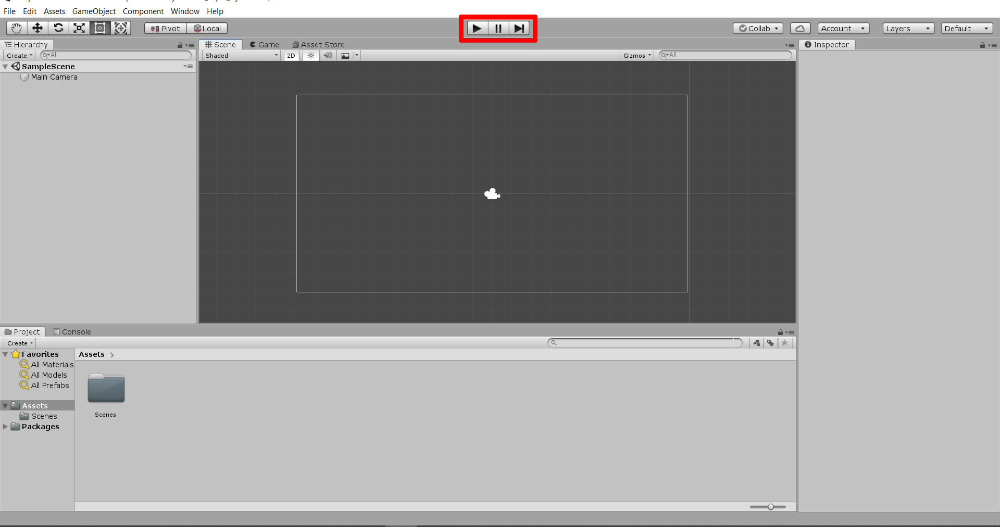

### Botones Navegacion

Estos se utilizan para mover los elementos dentro de nuestras escenas.

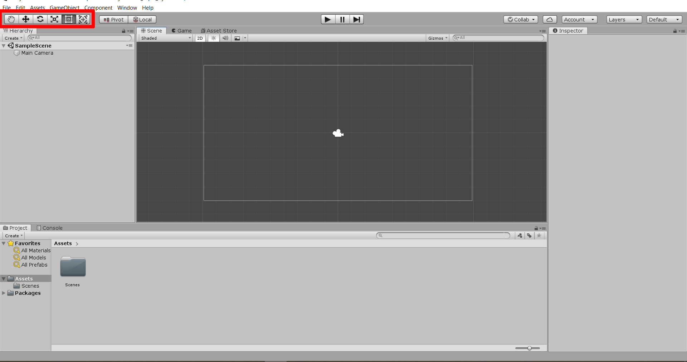

### Modo Play

Cuando reproducimos el juego nuestro editor automáticamente cambiará automáticamente a la ventana de game para reproducir el juego, mientras estemos en este modo cualquier cambio que realizaremos no se guardará, nuestro editor se verá ligeramente más oscuro.

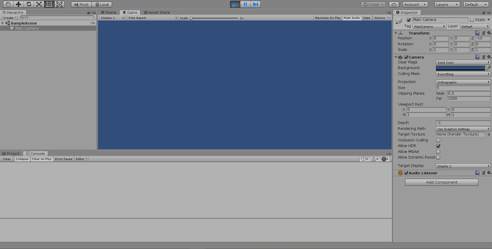

## Autor

- **Francisco Castañeda** - *Initial work* - [dragaus](https://github.com/dragaus)
