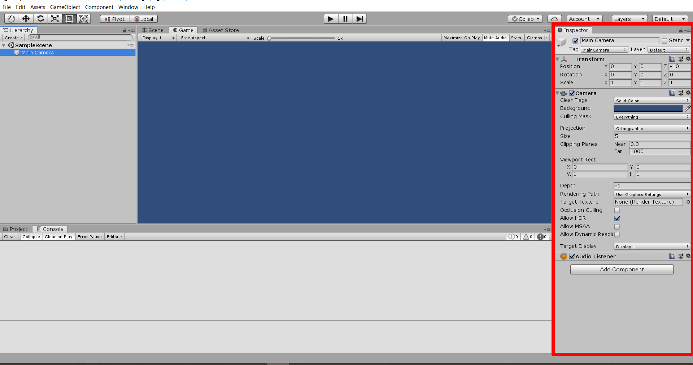

# Piedra Papel Tijeras

Este repositorio está hecho para poder aprender Unity3D y C# básico

Este proyecto está hecho en unity 2018.4.10(LTS) y se exportará para sistemas Windows Mac Linux y Webgl

## Cómo usarlo

### Para aprender

Sigue paso a paso las instrucciones en este README en caso de tener problemas puedes comparar tu proceso con el mío, en cada commit

### Para enseñar

Si deseas usar este material como recurso didáctico te recomiendo que leas este readme veas el proceso y si deseas hacer modificaciones haz fork a este repositorio, si por el contrario te parece bien y quieres usar la estructura que aquí propongo puedes clonar el repositorio con el siguiente comando:

``` bash
git clone https://github.com/dragaus/Piedra_Papel_Tijeras.git
```

No olvides reconocer la autoría

## Contenido en este repo

- [Crear el proyecto](#-Crear-el-proyecto)
- [Conociendo el editor](#-Conociendo-el-editor)
- [Nuestro primer codigo](#-Nuestro-primer-codigo)
- [Variables](#-Variables)
- [Autor](#-Autor)

## Crear el proyecto

Para crear el proyecto necesitaremos tener instalado Unity Hub y Unity 2018.4.10(LTS).

Abriremos Unity Hub y en la pestaña de projects seleccionamos NEW en caso de tener múltiples versiones de Unity instaladas seleccionaremos la flecha y después escogeremos 2018.4.10


Nos abrirá una nueva ventana en esta seleccionaremos el template 2D (<span style="color:blue">en un círculo azul en la imagen</span>), pondremos un nombre al repositorio en la parte de project name (<span style="color:red">en círculo rojo</span>) en este caso Piedra_Papel_Tijeras, y después seleccionaremos la ruta donde deseamos que se genere el proyecto (<span style="color:green">en círculo verde</span>) y después seleccionaremos el botón CREATE.


Esto generará un nuevo proyecto y nos abrira el editor.


## Conociendo el editor

Vamos a hablar un poco del editor y de sus partes:

### Hierarchy

Aquí se irán organizando los GameObjects que vayamos agregando a nuestra escena, y en él podremos organizarlos.


### Scene

Aquí podremos modificar los elementos de nuestra escena para acomodarlos en la forma que deseemos dentro de la escena


### Game

Esta ventana se utilizará cuando corramos nuestro juego para mostrar un preview de como correria el juego ya en la plataforma exportada. Cabe recalcar que aunque el modo "Play" es una buena representación de como funcionara el juego, siempre se debe exportar el juego y probar en la plataforma deseada para corregir cualquier error que se muestre.


### Asset Store

Esta pestaña es una ventana web para abrir el asset store de unity aquí podremos comprar algunos plugins, No usaremos esta ventana en este Tutorial


### Inspector

Este apartado nos mostrará los detalles de los objetos que seleccionemos, más adelante conoceremos más de su uso.



### Project

Este es un explorador de archivos que tenemos dentro de nuestro editor para poder trabajar con ellos dentro de nuestro proyecto


### Console

Esta será nuestra consola, aquí se imprimirán mensajes relacionados al funcionamiento de nuestro proyecto, entre ellos advertencias, errores y más.


### Botones Editor

Estos botones se usan para Reproducir, Pausar y Adelantar(este se usa cuando el juego está en pausa y adelanta solo un frame).


### Botones Navegacion

Estos se utilizan para mover los elementos dentro de nuestras escenas.


### Modo Play

Cuando reproducimos el juego nuestro editor automáticamente cambiará automáticamente a la ventana de game para reproducir el juego, mientras estemos en este modo cualquier cambio que realizaremos no se guardará, nuestro editor se verá ligeramente más oscuro.


## Nuestro Primer Código

Bien ahora comenzaremos a programar, pero sin olvidar el orden para lograr esto, comenzaremos por crear una nueva carpeta que se llame Scripts, para lograrlo en la ventana de project haz click derecho, te saldra un menu, en la parte superior saldra la opcion de create seleccionala con el mouse y te abrirá un nuevo menú ahí te saldrá inmediatamente la opción folder seleccionalo y crearas un nuevo folder


Enseguida ingresa el nombre de nuestra carpeta en este caso Scripts, en caso de que pierdas la selección de la carpeta puedes renombrarlo presionando Enter en mac y F12 en windows.


Tu Proyecto se deberia de ver ahora así


Haz doble click en el folder Script y ahora crea un script de C# para lograrlo de nuevo en la ventana project haz click derecho >> Create >> C# Script


Nombralo "GameManager" es importante que aquí pongas el nombre inmediatamente después de crear el script y con esta estructura, los scripts no pueden tener espacios y se usa la nomenclatura , tu projecto se vera ahora así


Da doble click y te abrirá Visual Studio 2019

Verás un script asi

```cs
using System.Collections;
using System.Collections.Generic;
using UnityEngine;

public class GameManager : MonoBehaviour
{
    // Start is called before the first frame update
    void Start()
    {
        
    }

    // Update is called once per frame
    void Update()
    {
        
    }
}
```

Dentro de los corchetes de Start escribiremos el siguiente código

```cs
Debug.Log("Hola Mundo");
```

Te quedará un script asi:

```cs
using System.Collections;
using System.Collections.Generic;
using UnityEngine;

public class GameManager : MonoBehaviour
{
    // Start is called before the first frame update
    void Start()
    {
        Debug.Log("Hola Mundo");
    }

    // Update is called once per frame
    void Update()
    {
        
    }
}
```

Para poder correrlo necesitamos agregarlo en nuestra escena para lograr esto regresamos a nuestro editor y agregar un objeto llamado manager para lograrlo haremos lo siguiente en la pestaña de Hierarchy damos Click Derecho >> Create Empty


Para cambiar el nombre selecciona el elemento y en la ventana de hierarchy en la parte superior podrás cambiarle el nombre en este caso le pondremos Manager


Ahora en el boton de Add Component de nuestro Inspector agregaremos el script GameManager para hacerlo hacemos el siguiente proceso Add Componente >> Escribe GameManager >> Selecciona el elemento


Terminara tu elemento manager así


Ahora en la pestaña de Game asegurate de que no está habilitado Maximize On Play debería lucir algo así


Ahora presiona el botón Play, en la consola debería aparecer el mensaje Hola Mundo, también en la esquina inferior derecha de unity podrás ver siempre el último mensaje de la consola


¡Felicidades has hecho tu primer programa en Unity!

### Entendiendo nuestro código

Ahora te explicare que es cada parte de nuestro código

La primera región está conformada por:

```cs
using System.Collections;
using System.Collections.Generic;
using UnityEngine;
```

estos elementos son las librerías que usaremos en nuestro código más adelante entenderemos como agregar otras y como eliminar las que no utilizamos.

Después vemos lo siguiente:

```cs
public class GameManager : MonoBehaviour
```

public class definen que esta será una clase pública le sigue el nombre de la clase en este caso GameManager después, : que indican que esta clase hereda, seguido de la clase de la cual hereda MonoBehaviour, después de esta declaración las clases siempre se deben abrir y cerrar con corchetes.

```cs
public class GameManager : MonoBehaviour
{

}
```

Todo lo que esté dentro de estos corchetes estará contenido dentro de esa clase

Después vemos lo siguiente

```cs
    // Start is called before the first frame update
    void Start()
    {
        Debug.Log("Hola Mundo");
    }

    // Update is called once per frame
    void Update()
    {
        
    }
```

Todas las líneas de código que comienzan en // son comentarios estos nos ayudan a entender nuestro proceso de programación y no son interpretado por el compilador.

Después tenemos los métodos un método es una serie tareas que realizan una acción (Nota importante todas las clases que heredan de MonoBehaviour incluyen por default las funciones void Start y void Update ), cuando estas no regresan ningún valor se utiliza la palabra clave void para decirle a la computadora que eso es una clase seguida del nombre de la clase, paréntesis y por último llaves.

Dentro de esas llaves se ponen las instrucciones que se deben realizar para que la máquina lleve a cabo esa función

En el caso de la función Start tenemos la linea que hemos escrito

```cs
Debug.Log("Hola Mundo");
```

Esta es una función que incluye Unity y es la que imprime en la consola dentro de los paréntesis pasamos un argumento que es un texto en C# los textos o strings siempre se escriben entre " ", si quisieras cambiar el mensaje solo faltaria cambiar el texto que está dentro de los paréntesis para conseguir que nuestra consola imprima "Hola Pepe":

```cs
Debug.Log("Hola Pepe");
```

## Variables

Las variables son de los elementos más usados a la hora de programar son elementos que se utilizan para devolver un valor, puede ser un valor constante o un valor que se puede cambiar

todas las variables se escriben con la siguiente sintaxis:

> acceso (public, private, etc.) + tipo de variable (string, int, etc.) + nombre de variable (en lo general se usa lowerCamelCase) + ;

En C# y Unity existen múltiples tipos de variables las más comunes son:

### String o Cadena de texto

Un string o cadena de texto es una variable que almacena texto, su palabra clave es string, ejemplo:

```cs
private string miNombre = "Pepe";
```

### Integers o Enteros

Son números enteros estos no contienen puntos decimales, su palabra reservada es int, ejemplo:

```cs
private int miEdad = 26;
```

### Doubles o dobles

Estos son numeros decimales, su uso en videojuegos en poco se suele usar otro tipo de decimal, su palabra clave es double, ejemplo:

```cs
private double miEstatura = 20.3;
```

### Floats o decimales

Estos números son decimales, estos a diferencia de los doubles son muy utilizados en la creación de videojuegos, estos tienen la peculiaridad de que deben terminar con una f y su palabra reservada es float, ejemplo:

```cs
private float miPeso = 68.8f;
```

### Booleans o booleanos

Estos son valores binarios que solo pueden ser true(verdadero) o false(falso), su palabra reservada es bool, ejemplo:

```cs
private bool soyListo = true;
```

### Usando variables en nuestro proyecto

Ahora empezaremos a usar variables para eso iremos a nuestro script GameManager y después del corchete de la clase agregaremos una variable del tipo string que se llame miNombre, tu código debe quedar asi:

```cs
using System.Collections;
using System.Collections.Generic;
using UnityEngine;

public class GameManager : MonoBehaviour
{
    string miNombre = "Pancho";

    // Start is called before the first frame update
    void Start()
    {
        Debug.Log("Hola Mundo");
    }

    // Update is called once per frame
    void Update()
    {
        
    }
}
```

Ahora para lograr que el programa nos salude usaremos una función que se llama interpolación, que es agregar a una cadena de texto una variable para eso modificaremos la línea Debug.Log("Hola Mundo") por Debug.Log($"Hola {miNombre}"), lo cual debe dar el siguiente resultado:

```cs
using System.Collections;
using System.Collections.Generic;
using UnityEngine;

public class GameManager : MonoBehaviour
{
    string miNombre = "Pancho";

    // Start is called before the first frame update
    void Start()
    {
        Debug.Log($"Hola {miNombre}");
    }

    // Update is called once per frame
    void Update()
    {
        
    }
}
```

al usar el símbolo $ estamos diciendo que usaremos la interpolación y el elemento entre corchetes es el que se agregara

Si guardamos el script y corremos nuestro programa en Unity la consola correrá el siguiente mensaje en este caso "Hola Pancho".

## Autor

- **Francisco Castañeda** - *Initial work* - [dragaus](https://github.com/dragaus)
